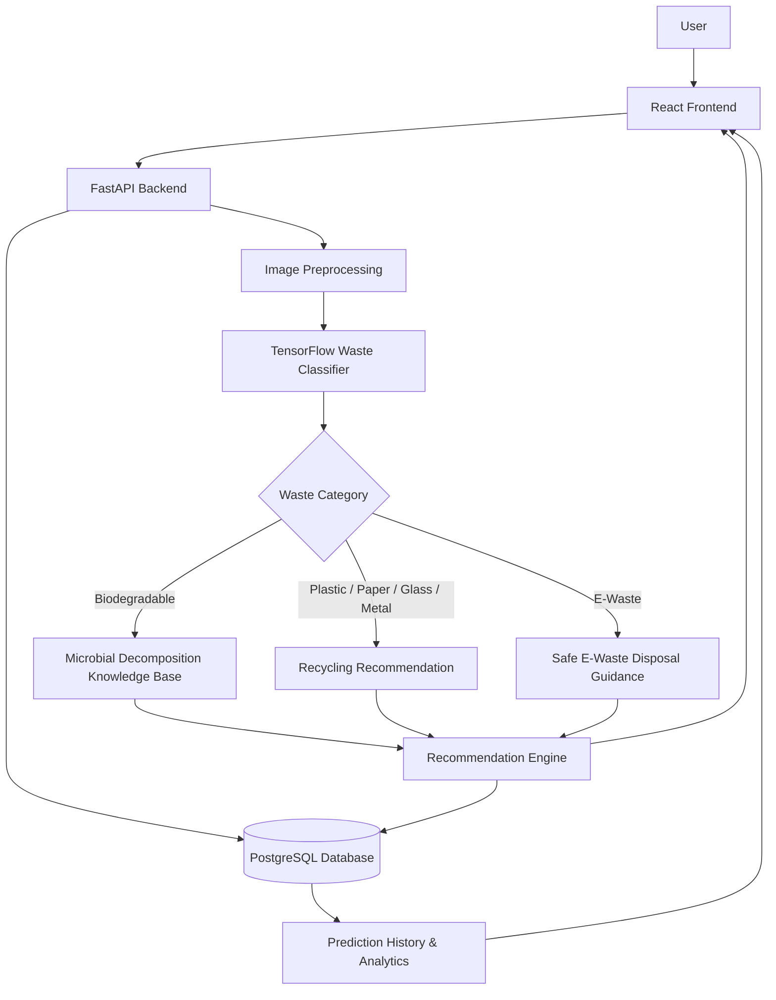

# ♻️ AI-Based Waste Segregation and Microbial Decomposition Recommendation System

> **Project Status:** 🚧 Under Development — Phase 1: Dataset Preparation & AI Waste Classification

An AI-powered waste management system that classifies waste from images, recommends the appropriate segregation/disposal method, and provides literature-backed microbial decomposition information for biodegradable waste.

---

## 📌 Project Overview

Improper waste segregation reduces recycling efficiency and increases environmental pollution. This project aims to build an intelligent system that can:

- Identify waste from an uploaded or captured image.
- Classify it into a waste category.
- Show prediction confidence.
- Recommend suitable disposal or recycling methods.
- Provide microbial decomposition guidance for biodegradable waste.
- Store prediction history and recommendations in a database.
- Display waste analytics through a web dashboard.

The project combines **Artificial Intelligence, Computer Vision, Web Development, Database Management, and Environmental Sustainability**.

---

## 🎯 Objectives

1. Develop an AI model capable of classifying common waste categories.
2. Use transfer learning for accurate and efficient image classification.
3. Build a web interface for image upload and webcam capture.
4. Develop a REST API that connects the frontend, AI model, and database.
5. Create a knowledge base for biodegradable-waste decomposition.
6. Recommend recycling/disposal methods for non-biodegradable waste.
7. Evaluate the AI model using standard classification metrics.
8. Add explainable AI using Grad-CAM.
9. Build a dashboard showing waste-classification statistics.
10. Keep the system extendable for future IoT-based compost monitoring.

---

## 🗑️ Planned Waste Classes

The first version of the classifier will use six main categories:

| Class | Example Waste | Main Recommendation |
|---|---|---|
| 🌱 Biodegradable | Food waste, fruit peels, vegetable waste | Composting / decomposition |
| 🧴 Plastic | Bottles, containers, wrappers | Recycling / dry waste |
| 📄 Paper | Newspaper, cardboard, office paper | Recycling |
| 🍾 Glass | Glass bottles and containers | Glass recycling |
| 🥫 Metal | Cans, metal containers | Metal recycling |
| 🔌 E-Waste | Circuit boards, cables, electronic parts | Authorized e-waste collection |

---

## 🔄 System Workflow

```text
User
  │
  ▼
Upload / Capture Waste Image
  │
  ▼
Image Preprocessing
  │
  ▼
AI Waste Classification
  │
  ▼
Predicted Category + Confidence
  │
  ├────────────── Biodegradable ──────────────┐
  │                                            ▼
  │                              Microbial Decomposition
  │                              Knowledge Base / Guidance
  │
  └────────── Non-Biodegradable
               │
               ▼
       Recycling / Disposal Guidance
               │
               ▼
        Save Prediction History
               │
               ▼
         Analytics Dashboard
```

---

## ✨ Planned Features

### 🤖 AI & Computer Vision
- Waste image classification
- Transfer learning
- Image preprocessing
- Data augmentation
- Confidence score
- Real-image testing
- Grad-CAM explainability
- Model performance evaluation

### 🌱 Microbial Decomposition
- Biodegradable-waste knowledge base
- Composting recommendations
- Literature-backed microbial information
- Temperature, moisture, pH, and decomposition-condition information
- Estimated decomposition information based on references

### 🌐 Web Application
- Image upload
- Webcam capture
- Classification results
- Disposal/recycling recommendations
- Decomposition information
- Prediction history
- Waste guide
- Analytics dashboard
- User feedback

### 📊 Analytics
- Waste distribution
- Category counts
- Daily prediction statistics
- Model confidence statistics
- Accuracy/loss graphs
- Confusion matrix

---

## 🧠 AI Model Strategy

The project will initially use **MobileNetV3Small** with transfer learning because it is lightweight and suitable for web and real-time applications.

A later experiment may compare:

- MobileNetV3Small
- EfficientNetV2B0

This will allow comparison of accuracy, F1-score, inference speed, and model size.

---

## 🧪 Model Evaluation

The AI model will be evaluated using:

- Accuracy
- Precision
- Recall
- F1-score
- Confusion Matrix
- Training Accuracy
- Validation Accuracy
- Training Loss
- Validation Loss

---

## 🛠️ Technology Stack

> Target development stack verified for **18 September 2026**.  
> Python 3.13 is intentionally selected because TensorFlow 2.21 provides Python 3.13 builds.

| Area | Technology | Target Version | Purpose |
|---|---|---:|---|
| Language | Python | 3.13.15 | AI and backend |
| Deep Learning | TensorFlow / Keras | 2.21.0 | Waste classifier |
| Computer Vision | OpenCV Python | 5.0.0.93 | Image processing |
| ML Evaluation | scikit-learn | 1.9.1 | Metrics and confusion matrix |
| Data Processing | Pandas | 3.0.6 | Dataset analysis |
| Visualization | Matplotlib | 3.11.2 | Training graphs |
| Backend API | FastAPI | 0.141.1 | REST API |
| API Server | Uvicorn | 0.53.0 | FastAPI server |
| ORM | SQLAlchemy | 2.0.54 | Database operations |
| PostgreSQL Driver | Psycopg | 3.3.5 | Python ↔ PostgreSQL |
| Database | PostgreSQL | 18 | Application database |
| Frontend | React | 19.3 | Web interface |
| Frontend Build Tool | Vite | 8.3.0 | React development/build |
| Runtime | Node.js | 24.21.0 LTS | Frontend tooling |
| Styling | Tailwind CSS | 4.3 | UI styling |
| Charts | Recharts | 3.10.1 | Dashboard charts |
| Containerization | Docker Desktop | 4.91.0 | Deployment |
| API Testing | Postman | Latest stable | API testing |
| UI Design | Figma | Latest stable | UI/UX design |
| Version Control | Git + GitHub | Latest stable | Source control |

---

## 🏗️ Proposed Architecture



---

## 🧩 Main Project Modules

### 1. Image Acquisition Module
Users will be able to:
- Upload JPG, JPEG, PNG, or WebP images.
- Capture waste images using a webcam.
- Preview images before classification.

### 2. Image Preprocessing Module
Planned operations:
- Image resizing
- RGB conversion
- Normalization
- Data augmentation
- Invalid/corrupted-image checking

### 3. AI Classification Module
The model will return information such as:

```json
{
  "prediction": "Plastic",
  "confidence": 96.47,
  "recyclable": true,
  "biodegradable": false
}
```

### 4. Recommendation Module
Example result:

```text
Detected Waste: Plastic Bottle
Category: Plastic
Confidence: 96.47%
Biodegradable: No
Recyclable: Yes
Recommended Action: Dry-waste recycling
```

### 5. Microbial Decomposition Module
For biodegradable waste, the system will provide information such as:
- Waste type
- Composting/decomposition method
- Relevant microbial groups
- Suitable environmental conditions
- Literature reference
- Estimated decomposition information where scientifically supported

> Microbial information will be based on published scientific literature and used as an informational recommendation system.

### 6. Backend API Module
FastAPI will connect:
- Frontend
- TensorFlow model
- Recommendation engine
- PostgreSQL database

### 7. Database Module
Planned tables:

```text
users
waste_categories
waste_items
microorganisms
decomposition_profiles
predictions
recommendations
feedback
```

### 8. Dashboard Module
Planned dashboard information:
- Total scans
- Category distribution
- Scans per day
- Prediction confidence
- Recycling/biodegradable statistics

---

## 🌐 Planned API Endpoints

| Method | Endpoint | Purpose |
|---|---|---|
| GET | `/health` | Check API status |
| POST | `/api/predict` | Classify uploaded waste image |
| GET | `/api/waste/categories` | Get waste categories |
| GET | `/api/waste/{id}` | Get waste information |
| GET | `/api/decomposition/{waste}` | Get decomposition information |
| GET | `/api/predictions` | Prediction history |
| POST | `/api/feedback` | Save user feedback |

---

## 📁 Proposed Project Structure

```text
waste-segration-and-microbial-decomposition/
│
├── ai/
│   ├── notebooks/
│   │
│   ├── training/
│   │   ├── train.py
│   │   ├── evaluate.py
│   │   └── augmentation.py
│   │
│   ├── inference/
│   │   └── predictor.py
│   │
│   └── models/
│       └── waste_classifier.keras
│
├── backend/
│   ├── app/
│   │   ├── main.py
│   │   ├── api/
│   │   ├── models/
│   │   ├── schemas/
│   │   ├── services/
│   │   └── database/
│   │
│   ├── tests/
│   └── requirements.txt
│
├── frontend/
│   ├── src/
│   │   ├── components/
│   │   ├── pages/
│   │   ├── services/
│   │   ├── assets/
│   │   └── App.jsx
│   │
│   └── package.json
│
├── database/
│   ├── schema.sql
│   └── seed.sql
│
├── data/
│   ├── raw/
│   ├── processed/
│   └── sample/
│
├── docs/
│   ├── architecture/
│   ├── diagrams/
│   ├── report/
│   └── screenshots/
│
├── docker/
├── .github/
│   └── workflows/
│
├── .gitignore
├── docker-compose.yml
├── LICENSE
└── README.md
```

---

## 📊 Dataset Structure

The training dataset will follow a folder-per-class structure:

```text
data/
├── train/
│   ├── biodegradable/
│   ├── plastic/
│   ├── paper/
│   ├── glass/
│   ├── metal/
│   └── e-waste/
│
├── validation/
│   ├── biodegradable/
│   ├── plastic/
│   ├── paper/
│   ├── glass/
│   ├── metal/
│   └── e-waste/
│
└── test/
    ├── biodegradable/
    ├── plastic/
    ├── paper/
    ├── glass/
    ├── metal/
    └── e-waste/
```

> ⚠️ The complete dataset should **not** be committed directly to GitHub if it is large.  
> Only a small sample and dataset instructions should be kept in the repository.

---

## 🚀 Development Roadmap

### Phase 1 — Planning & Dataset
- [x] Create GitHub repository
- [x] Define project concept
- [x] Select initial technology stack
- [ ] Create professional repository structure
- [ ] Select/finalize dataset
- [ ] Clean dataset
- [ ] Split training/validation/test data
- [ ] Balance waste classes

### Phase 2 — AI Waste Classifier
- [ ] Implement preprocessing
- [ ] Implement augmentation
- [ ] Train MobileNetV3Small
- [ ] Save trained model
- [ ] Implement single-image prediction
- [ ] Evaluate accuracy, precision, recall, and F1-score
- [ ] Generate confusion matrix
- [ ] Compare with EfficientNetV2B0

### Phase 3 — Microbial Knowledge Base
- [ ] Research scientific references
- [ ] Design decomposition database
- [ ] Add biodegradable-waste records
- [ ] Add decomposition-condition information
- [ ] Connect recommendations to classified waste

### Phase 4 — Backend
- [ ] Create FastAPI project
- [ ] Implement prediction API
- [ ] Connect TensorFlow model
- [ ] Configure PostgreSQL
- [ ] Add prediction history
- [ ] Add recommendation endpoints
- [ ] Add validation and error handling

### Phase 5 — Frontend
- [ ] Create React + Vite application
- [ ] Configure Tailwind CSS
- [ ] Build image-upload page
- [ ] Add webcam capture
- [ ] Build result page
- [ ] Add waste guide
- [ ] Add decomposition-information page
- [ ] Build analytics dashboard

### Phase 6 — Advanced Features
- [ ] Grad-CAM explainability
- [ ] Prediction history
- [ ] Feedback system
- [ ] Dashboard charts
- [ ] Model comparison
- [ ] Real-time/webcam classification

### Phase 7 — Testing & Deployment
- [ ] API testing
- [ ] Frontend testing
- [ ] Model testing
- [ ] Dockerize project
- [ ] Add GitHub Actions
- [ ] Deploy application

### Phase 8 — Optional IoT Expansion
- [ ] ESP32 integration
- [ ] Temperature monitoring
- [ ] Moisture monitoring
- [ ] Compost-condition dashboard

---

## ⚙️ Local Development Setup

### Prerequisites

Install:

- Git
- Python 3.13.x
- Node.js 24 LTS
- PostgreSQL 18
- VS Code
- Postman

---

### 1. Clone the Repository

```bash
git clone https://github.com/Atharva64/waste-segration-and-microbial-decomposition.git
cd waste-segration-and-microbial-decomposition
```

---

### 2. Create Python Virtual Environment

```bash
python -m venv .venv
```

Windows:

```bash
.venv\Scripts\activate
```

Linux/macOS:

```bash
source .venv/bin/activate
```

---

### 3. Install AI Dependencies

```bash
pip install tensorflow==2.21.0
pip install opencv-python==5.0.0.93
pip install scikit-learn==1.9.1
pip install pandas==3.0.6
pip install matplotlib==3.11.2
```

---

### 4. Install Backend Dependencies

```bash
pip install fastapi==0.141.1
pip install uvicorn==0.53.0
pip install sqlalchemy==2.0.54
pip install "psycopg[binary]==3.3.5"
```

---

### 5. Frontend Setup

```bash
npm create vite@latest frontend -- --template react
cd frontend
npm install
npm install tailwindcss axios recharts
npm run dev
```

---

## 🧹 Recommended `.gitignore`

```gitignore
# Python
.venv/
venv/
__pycache__/
*.pyc

# Environment variables
.env

# Datasets
data/raw/
data/train/
data/validation/
data/test/

# Trained models
*.keras
*.h5

# Node
frontend/node_modules/
frontend/dist/

# IDE
.vscode/
.idea/

# OS files
.DS_Store
Thumbs.db
```

---

## 🔬 Future Enhancements

Possible future additions:

- Live camera classification
- Mobile application
- Geolocation-based recycling-center information
- Multi-language interface
- QR-based waste tracking
- Smart-bin integration
- ESP32/IoT compost monitoring
- Temperature and moisture sensors
- Cloud deployment
- More detailed waste subclasses
- AI-based object detection for multiple waste items in one image

---

## 📈 Expected Final System

```text
Image
  ↓
AI Classification
  ↓
Waste Category + Confidence
  ↓
Recommendation Engine
  ├── Recycling Guidance
  ├── E-Waste Guidance
  └── Microbial Decomposition Information
  ↓
PostgreSQL Database
  ↓
React Dashboard
```

---

## 👨‍💻 Development Tools

- **VS Code** — Coding
- **Google Colab** — Model training/experiments
- **Kaggle** — Dataset source
- **GitHub** — Version control
- **Postman** — API testing
- **pgAdmin** — PostgreSQL management
- **Figma** — UI/UX design
- **Docker** — Deployment
- **GitHub Actions** — CI/CD

---

## 📚 Scientific Data Note

Microbial decomposition recommendations in this project should be based on **peer-reviewed research papers, books, government resources, or other credible scientific sources**.

The software is intended to provide educational and waste-management guidance. It should not invent microorganism properties or laboratory conditions.

---

## 🤝 Contributing

This project is currently under development.

Suggestions, bug reports, dataset improvements, UI improvements, and model experiments are welcome through GitHub Issues and Pull Requests.

---

## 📄 License

A project license will be added before public release.

---

## ⭐ Current Goal

The immediate goal is to complete a working **Phase 1 prototype**:

```text
Upload Waste Image
        ↓
TensorFlow Model
        ↓
Waste Category
        ↓
Confidence Score
```

After the classifier is reliable, the backend, database, microbial-decomposition module, and React dashboard will be integrated step by step.

---

### ♻️ Building smarter waste segregation with AI for a cleaner and more sustainable future.
